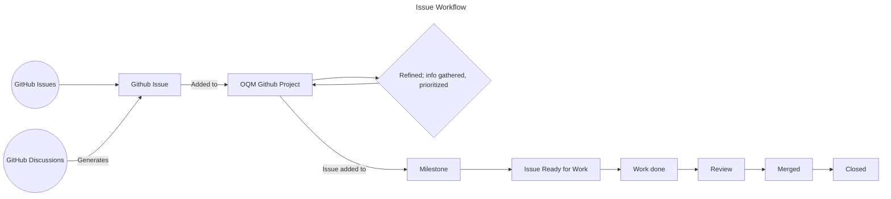
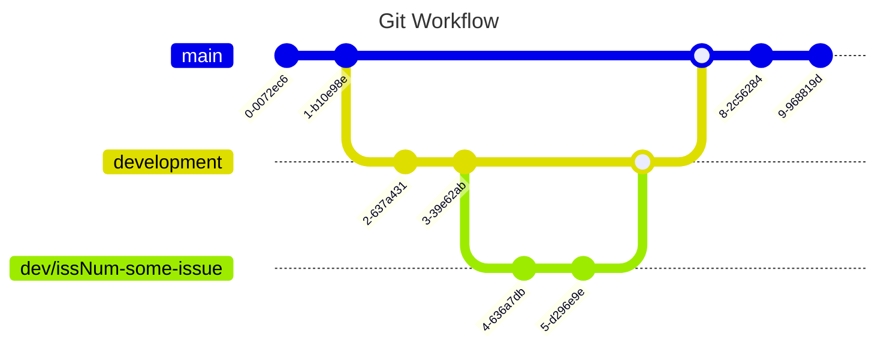

## How to contribute to Open QuarterMaster

### How we conduct our project management

#### Issue Workflow

#### Git Workflow

### Did you find a bug?

* **Do not open up a GitHub issue if the bug is a security vulnerability
  in Open QuarterMaster**, and instead to refer to our [security policy](https://github.com/Epic-Breakfast-Productions/OpenQuarterMaster/security/policy).

* **Ensure the bug was not already reported** by searching on GitHub under [Issues](https://github.com/Epic-Breakfast-Productions/OpenQuarterMaster/issues).

* If you're unable to find an open issue addressing the problem, [open a new one](https://github.com/Epic-Breakfast-Productions/OpenQuarterMaster/issues/new). Be sure to include a **title and clear description**, as much relevant information as possible, and a **code sample** or an **executable test case** demonstrating the expected behavior that is not occurring.

* If possible, use the relevant bug report templates to create the issue.

### **Did you write a patch that fixes a bug?**

* Open a new GitHub pull request with the patch.

* Ensure the PR description clearly describes the problem and solution. Include the relevant issue number if applicable.

* Ensure you are working off of the `development` branch, and making your PR merge into that branch.
  
* Typically, working branches are structured as `dev/<issue # / name>`, to help denote the branch flow

### **Do you intend to add a new feature or change an existing one?**

* Suggest your change in the form of a Github discussion, then if positive feedback, add a new feature request and start writing code.

* Do not open an issue on GitHub until you have collected positive feedback about the change. GitHub issues are primarily intended for bug reports and fixes.

### **Do you have questions about the source code?**

* Ask any question in [Github Discussions](https://github.com/Epic-Breakfast-Productions/OpenQuarterMaster/discussions)

