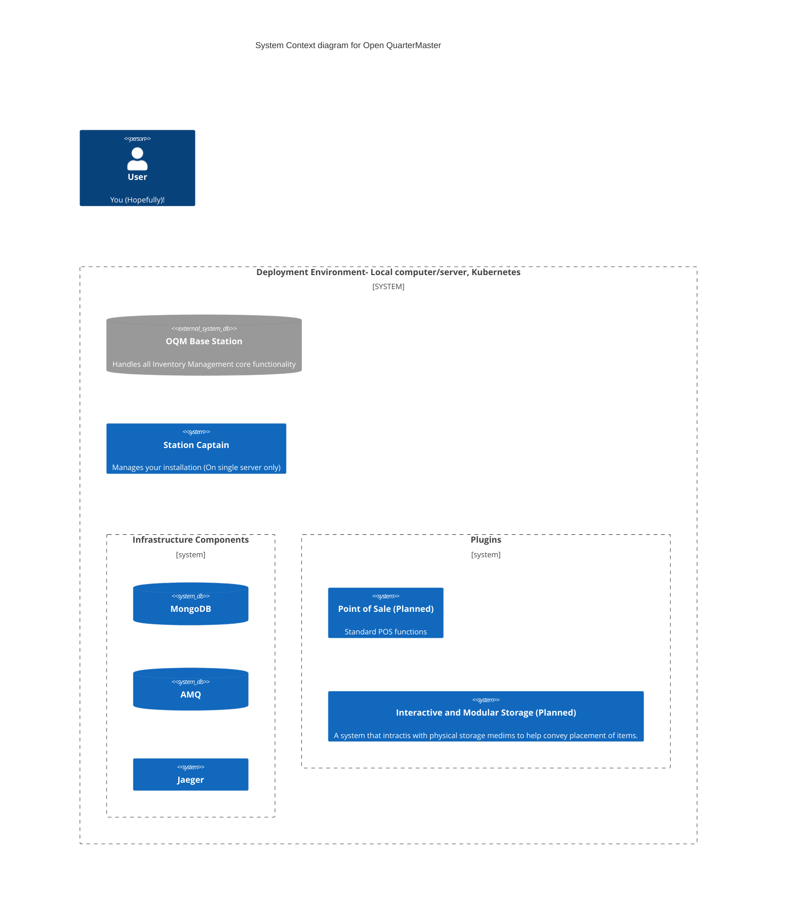

# Open QuarterMaster

<!-- https://shields.io -->

[//]: # (![Station Captain]&#40;https://github.com/Epic-Breakfast-Productions/OpenQuarterMaster/actions/workflows/stationCaptain.yml/badge.svg&#41;)

<!-- ALL-CONTRIBUTORS-BADGE:START - Do not remove or modify this section -->

<!-- ALL-CONTRIBUTORS-BADGE:END -->

**Inventory without a catch, and all the hooks**

Open Quartermaster is an open source inventory management system, designed to be simple to use yet powerful and extendable. The last inventory management system you will ever need!

**For a quick start running on your own computer, check out [Single Host Deployment](deployment/Single%20Host)**

We are very much in development still, so check back often! We are also accepting any and all assistance, so feel free to report issues or feature requests, as well as pull requests!

## How it works

Please use the diagram above for reference.

How we acomplish the goal of being the only inventory management system you could ever need is through our modular design. The main component of Open QuarterMaster is the [Base Station](software/oqm-core-base-station). Think of this as the central hub and core functionality of the system. It handles all the generic inventory management tasks; what is stored where, and facts about what is stored. This central component is designed to be, on the whole, generic and accessible.

To cover specific use-cases, we have what we call [Plugins](software/plugins). These are components that extend the functionality of the basic inventory management, and fill additional needs with their own capabilities. Examples could include Smart Refrigerator integrations, a system for interacting with physical storage mediums, Point of Sale Systems, Workflow management.. the list is endless. You could even create your own!

In the theme of flexibility, the system is designed to be run in many different environments. It is just as home on the cloud as well as something as small as a [Raspberry Pi](https://www.raspberrypi.com/). This is accomplished using containers, segmenting each software component, ensuring flexibility and ease of management.

To get started on your own hardware, please see [Station Captain](deployment/Single%20Host/Station-Captain)

## On Privacy

Being an open initiative, we take great care to ensure you are in control of your own data. None of the software we include here phones home at all, with the brief exception of Station Captain, which looks to this Git repository for installations and updates. If you have a simple setup on your own hardware, you can expect your data to stay with you, and not transmitted anywhere by the software we include here.

## Contributors ✨

Thanks goes to these wonderful people ([emoji key](https://allcontributors.org/docs/en/emoji-key)):

<!-- ALL-CONTRIBUTORS-LIST:START - Do not remove or modify this section -->
<!-- prettier-ignore-start -->
<!-- markdownlint-disable -->
<table>
  <tbody>
    <tr>
      <td align="center" valign="top" width="14.28%"><a href="http://gjstewart.net"> <b>Greg Stewart</b></a> <a href="https://github.com/Epic-Breakfast-Productions/OpenQuarterMaster/issues?q=author%3AGregJohnStewart" title="Bug reports">🐛</a> <a href="#business-GregJohnStewart" title="Business development">💼</a> <a href="https://github.com/Epic-Breakfast-Productions/OpenQuarterMaster/commits?author=GregJohnStewart" title="Code">💻</a> <a href="#content-GregJohnStewart" title="Content">🖋</a> <a href="#data-GregJohnStewart" title="Data">🔣</a> <a href="https://github.com/Epic-Breakfast-Productions/OpenQuarterMaster/commits?author=GregJohnStewart" title="Documentation">📖</a> <a href="#design-GregJohnStewart" title="Design">🎨</a> <a href="#ideas-GregJohnStewart" title="Ideas, Planning, & Feedback">🤔</a> <a href="#infra-GregJohnStewart" title="Infrastructure (Hosting, Build-Tools, etc)">🚇</a> <a href="#maintenance-GregJohnStewart" title="Maintenance">🚧</a> <a href="#projectManagement-GregJohnStewart" title="Project Management">📆</a> <a href="#tool-GregJohnStewart" title="Tools">🔧</a> <a href="https://github.com/Epic-Breakfast-Productions/OpenQuarterMaster/commits?author=GregJohnStewart" title="Tests">⚠️</a></td>
      <td align="center" valign="top" width="14.28%"><a href="https://github.com/anixon-rh"> <b>Anthony Nixon</b></a> <a href="#infra-anixon-rh" title="Infrastructure (Hosting, Build-Tools, etc)">🚇</a> <a href="#mentoring-anixon-rh" title="Mentoring">🧑‍🏫</a></td>
      <td align="center" valign="top" width="14.28%"><a href="https://github.com/kfrankli"> <b>kfrankli</b></a> <a href="https://github.com/Epic-Breakfast-Productions/OpenQuarterMaster/commits?author=kfrankli" title="Documentation">📖</a></td>
      <td align="center" valign="top" width="14.28%"><a href="https://github.com/ajoline"> <b>ajoline</b></a> <a href="#mentoring-ajoline" title="Mentoring">🧑‍🏫</a> <a href="https://github.com/Epic-Breakfast-Productions/OpenQuarterMaster/pulls?q=is%3Apr+reviewed-by%3Aajoline" title="Reviewed Pull Requests">👀</a> <a href="#security-ajoline" title="Security">🛡️</a></td>
      <td align="center" valign="top" width="14.28%"><a href="https://github.com/piercde12"> <b>piercde12</b></a> <a href="#business-piercde12" title="Business development">💼</a> <a href="#content-piercde12" title="Content">🖋</a> <a href="https://github.com/Epic-Breakfast-Productions/OpenQuarterMaster/commits?author=piercde12" title="Documentation">📖</a> <a href="#design-piercde12" title="Design">🎨</a> <a href="https://github.com/Epic-Breakfast-Productions/OpenQuarterMaster/commits?author=piercde12" title="Tests">⚠️</a> <a href="#userTesting-piercde12" title="User Testing">📓</a></td>
      <td align="center" valign="top" width="14.28%"><a href="https://github.com/kyleclarktech"> <b>Kyle Clark</b></a> <a href="#content-kyleclarktech" title="Content">🖋</a> <a href="#ideas-kyleclarktech" title="Ideas, Planning, & Feedback">🤔</a> <a href="#mentoring-kyleclarktech" title="Mentoring">🧑‍🏫</a> <a href="https://github.com/Epic-Breakfast-Productions/OpenQuarterMaster/pulls?q=is%3Apr+reviewed-by%3Akyleclarktech" title="Reviewed Pull Requests">👀</a> <a href="#security-kyleclarktech" title="Security">🛡️</a> <a href="https://github.com/Epic-Breakfast-Productions/OpenQuarterMaster/commits?author=kyleclarktech" title="Tests">⚠️</a> <a href="#userTesting-kyleclarktech" title="User Testing">📓</a></td>
    </tr>
  </tbody>
</table>

<!-- markdownlint-restore -->
<!-- prettier-ignore-end -->

<!-- ALL-CONTRIBUTORS-LIST:END -->

This project follows the [all-contributors](https://github.com/all-contributors/all-contributors) specification. Contributions of any kind welcome!
