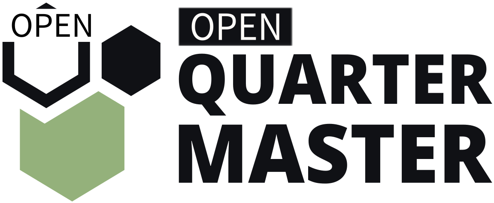

# OpenQuarterMaster

<!--TODO:: fix images to make this work well -->

<!-- ALL-CONTRIBUTORS-BADGE:START - Do not remove or modify this section -->

<!-- ALL-CONTRIBUTORS-BADGE:END -->

Open Quartermaster is an open source inventory management system, designed to be simple to use yet powerful and extendable.

See the [software](software) folder for more information!

We are very much in development still, so check back often! We are also accepting any and all assistance, so feel free to report issues or feature requests, as well as pull requests!

## Contributors ✨

Thanks goes to these wonderful people ([emoji key](https://allcontributors.org/docs/en/emoji-key)):

<!-- ALL-CONTRIBUTORS-LIST:START - Do not remove or modify this section -->
<!-- prettier-ignore-start -->
<!-- markdownlint-disable -->
<table>
  <tr>
    <td align="center"><a href="http://gjstewart.net"> <b>Greg Stewart</b></a> <a href="https://github.com/Epic-Breakfast-Productions/OpenQuarterMaster/issues?q=author%3AGregJohnStewart" title="Bug reports">🐛</a> <a href="#business-GregJohnStewart" title="Business development">💼</a> <a href="https://github.com/Epic-Breakfast-Productions/OpenQuarterMaster/commits?author=GregJohnStewart" title="Code">💻</a> <a href="#content-GregJohnStewart" title="Content">🖋</a> <a href="#data-GregJohnStewart" title="Data">🔣</a> <a href="https://github.com/Epic-Breakfast-Productions/OpenQuarterMaster/commits?author=GregJohnStewart" title="Documentation">📖</a> <a href="#design-GregJohnStewart" title="Design">🎨</a> <a href="#ideas-GregJohnStewart" title="Ideas, Planning, & Feedback">🤔</a> <a href="#infra-GregJohnStewart" title="Infrastructure (Hosting, Build-Tools, etc)">🚇</a> <a href="#maintenance-GregJohnStewart" title="Maintenance">🚧</a> <a href="#projectManagement-GregJohnStewart" title="Project Management">📆</a> <a href="#tool-GregJohnStewart" title="Tools">🔧</a> <a href="https://github.com/Epic-Breakfast-Productions/OpenQuarterMaster/commits?author=GregJohnStewart" title="Tests">⚠️</a></td>
    <td align="center"><a href="https://github.com/anixon-rh"> <b>Anthony Nixon</b></a> <a href="#infra-anixon-rh" title="Infrastructure (Hosting, Build-Tools, etc)">🚇</a> <a href="#mentoring-anixon-rh" title="Mentoring">🧑‍🏫</a></td>
  </tr>
</table>

<!-- markdownlint-restore -->
<!-- prettier-ignore-end -->

<!-- ALL-CONTRIBUTORS-LIST:END -->

This project follows the [all-contributors](https://github.com/all-contributors/all-contributors) specification. Contributions of any kind welcome!