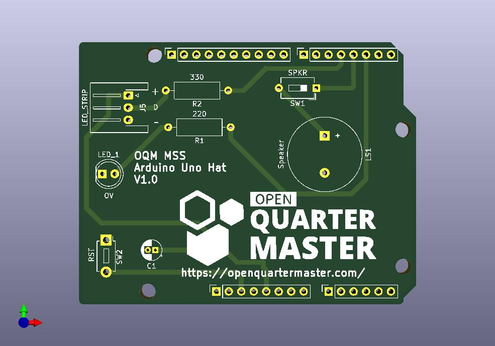

# OQM MSS Arduino Uno Hat

This is a Kicad project to create the PCB for the MSS Module controller hat for the Arduino Uno.

## Steps after updating

Steps after updating schematics/pcb:

 1. Write out BOM
   1. Schematic View
   1. Tools -> Generate Bill of Materials
   1. Select `outputs/OQM MSS Arduino Hat BOM.csv`
   1. Hit Export
 1. Update PCB
   1. PCB View
   1. Hit Update PCB from schematic (F8)
   1. Fill all zones (Edit -> Fill All Zones) (B)
 1. New Image
   1. PCB View
   1. 3D-Viewer (alt-3)
   1. Setup nice, squareish image
   1. Enable raytracing
   1. File -> export current fiew as JPEG, saving to outputs folder
   
## Get outputs for fabrication

 1. Put outputs in `outputs/fab/`
 1. For upload to PCBway, put all files in fab dir into a zip file.

References:

 - https://docs.kicad.org/8.0/en/getting_started_in_kicad/getting_started_in_kicad.html#fab
