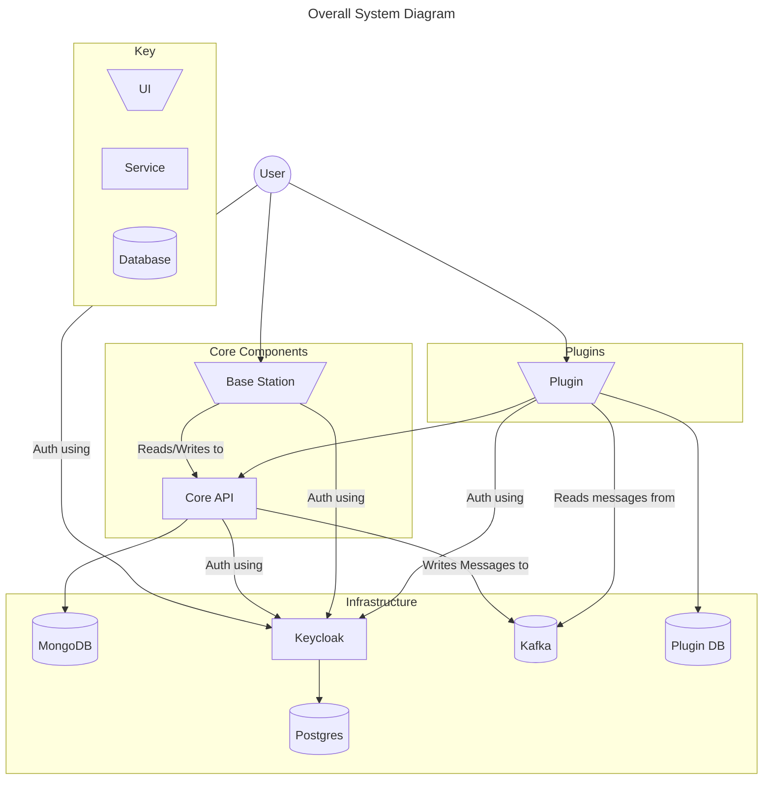

# Open QuarterMaster Software

[Back](../README.md)

This is where all the software we maintain for Open QuarterMaster lives.

- For the **Station Captain**, see [Station Captain](Station%20Captain)
- For more in-depth Documentation pertaining to all software, see [docs](docs)
- For the core components, see [core](core/)
  - [Core API](core/oqm-core-api)
  - [Base Station](core/oqm-core-base-station)
- For libraries, see [libs](libs/)
- For the central Base Station, see [oqm-core-base-station](oqm-core-base-station)
- For the drivers, see [drivers](drivers)
- For our officially supported plugins, see [plugins](plugins)

## Overall design

The above diagram describes how the system is designed, no matter the deployment method.

At the center of the system are the [core](core/) components. These make up the base functionalities of the system, and where plugins come in to extend that functionality. The [Core API](core/oqm-core-api) handles the bulk of this; all basic inventory handling is done through this service. The [Base Station](core/oqm-core-base-station) is our main front-end that users interact with. It is simply a wrapper of the functionalities provided by the Core API.

The Infrastructure section here is to denote which technologies we are building on top of. For example, the Core API directly relies on MongoDB as it's database backend, as well as writing messages to the Kafka broker. Generally, we prefer using [Keycloak](https://www.keycloak.org/) for our authentication needs, but this could be largely deployment specific.

[Plugins](plugins) operate separately from the core components, and add additional functionalities on top of the basic inventory management ones. One example is [providing an api to search for items from external sources](plugins/external-item-search). Plugins can both tie into existing database components, such as Kafka and Keycloak, or they can operate on their own with their own database.

For more information, please see the [overall docs directory](docs/), or the documentation for the individual groups or components.