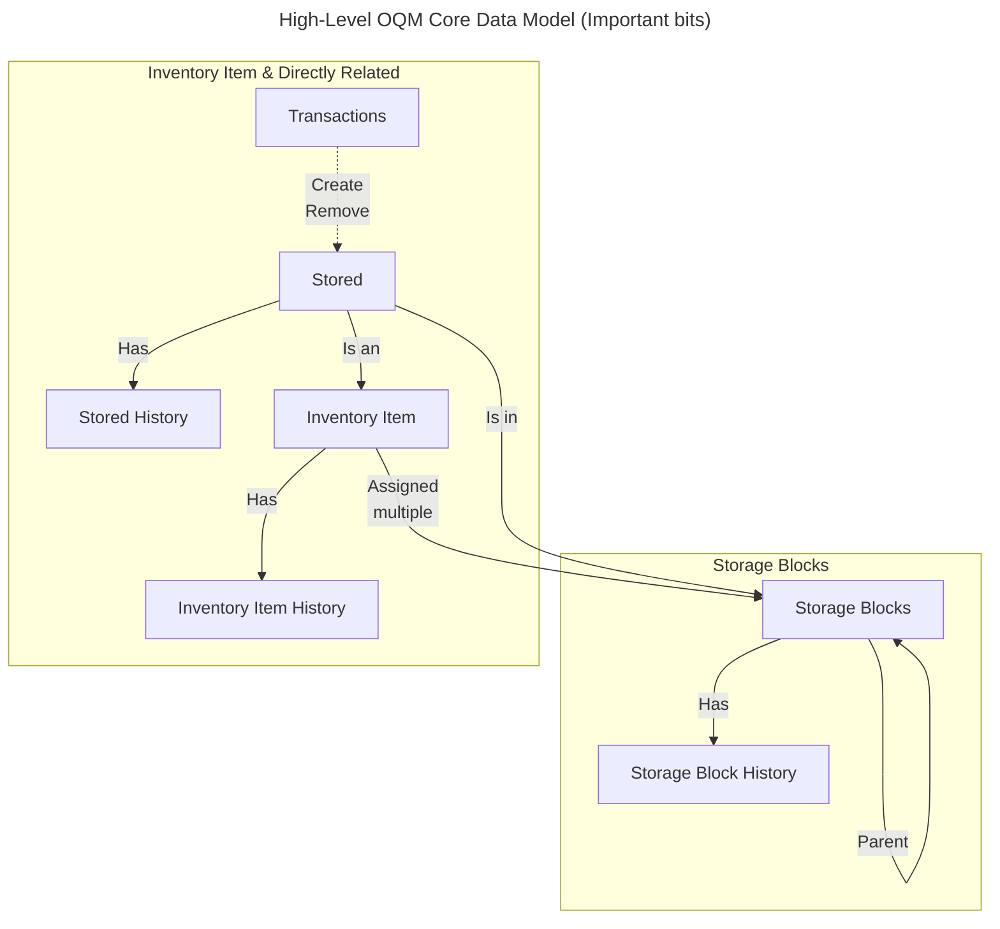

# Open QuarterMaster Base Station Data Models

[Back](README.md)

## Overall

This document is intended as a high-level overview to help grasp the overall organization of data. Specifics of each object can be found in your instance's swagger page, accessible at `/q/swagger/`.

Please keep this diagram in mind for the rest of this document.

## History events

We keep track of most changes to the data's state through `HistoryEvent` objects. For each update to occur to the object state, an event object is created.

Events are kept track of on a per-object basis, so events for items and storage blocks are kept separately. Most objects have histories.

## Storage Block

Storage blocks define where items can be stored. Think a single spot on a set of shelves, or a single drawer.

The blocks are organized in a hierarchy, where any storage block can define a parent.

Example layout of storage blocks:

 - Building 1
   - Floor 1
     - Shelves
       - Shelf 1
       - Shelf 2
       - ...

## Inventory Items

The tracking of the actual inventory has several components, listed in this section.

 - Item
 - Stored
 - Transactions

### Item

This object describes the category of item to store, but not a physical item itself (that's the Stored object).

The InventoryItem object outlines the type of storage the item should use, as well as general facts that apply to all items stored that are this type.

#### Storage types

### Stored

### Transactions

