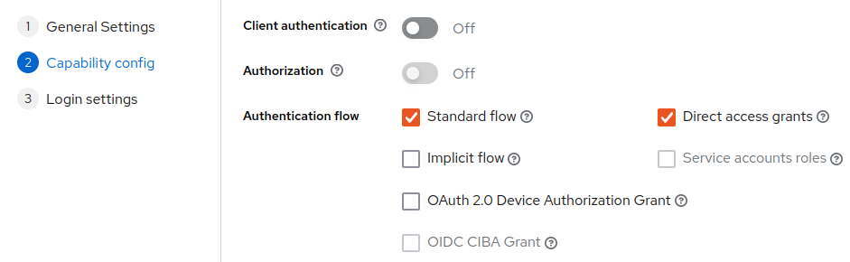
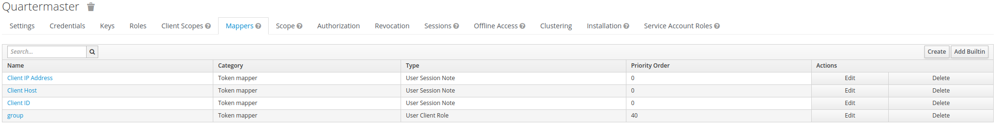

# Users and Authentication

[Back](README.md)

This guide explains how users are authenticated in this system.

- https://auth0.com/docs/authorization/flows/authorization-code-flow-with-proof-key-for-code-exchange-pkce

## Authentication

The endpoints on this server are protected by RBAC controls, utilizing JWT's.

If the config value `service.authMode` is set to `SELF`, then the service itself will provide those tokens and user
management.

If the config value is `EXTERNAL`, then the service assumes an external credential provider is at play and won't perform
user management.

### JWT

- https://quarkus.io/guides/security-keycloak-authorization
- https://quarkus.io/guides/security-openid-connect-web-authentication
- https://quarkus.io/guides/security-oauth2

#### Claims

The following claims are considered in this application:

|   Claim name | Short for         | TL;DR/ Description/ Data description                                                             | Usage in SELF auth mode | Usage in EXTERNAL auth mode                       |
|-------------:|-------------------|:-------------------------------------------------------------------------------------------------|:------------------------|:--------------------------------------------------|
|          sub | Subject           | Subject of JWT, is the user's id String                                                          | -                       | Used as the value for `User.external ids`         |
|          iss | Issuer            | The issuer of the JWT, The entity that issued the token.                                         | -                       | Used as the key for `User.external ids`           |
|          upn | userPrincipalName | The user's sign-in name. Username.                                                               | -                       | Used as the value for                             |
|        email |                   | The user's email.                                                                                | -                       | Used as the user's email in the internal db.      |
|        title |                   | The user's title.                                                                                | -                       | Used as the user's title in the internal db.      |
|   given_name |                   | The user's given/ first name.                                                                    | -                       | Used as the user's first name in the internal db. |
|  family_name |                   | The user's family/ last name.                                                                    | -                       | Used as the user's last name in the internal db.  |
| roleMappings |                   | Unused                                                                                           | -                       | -                                                 |
|       groups |                   | The roles for what the user should be allowed to do                                              | -                       | -                                                 |
|          aud | audience          | The audience for the token; Recipient for which the JWT is intended. User identification string. | -                       | -                                                 |
|    auth_time |                   | The epoch time of when the authorization happened                                                | -                       | -                                                 |
|          exp | expiration time   | The epoch time of when the token will expire                                                     | -                       | -                                                 |
|          jti | JWT ID            | Unique ID of the token, allows revocation of the token or for it to only be used once.           | -                       |                                                   |

References:

- https://auth0.com/docs/security/tokens/json-web-tokens/json-web-token-claims

### For External Auth

For the service to work with `service.authMode` set to `EXTERNAL`:

- service needs the `mp.jwt.verify.publickey` set to the public key cert from the issuer of the jwt tokens
- Tokens need to be provided with all claims listed above

#### Setting up for Keycloak Realm

1. Have a realm (in tests, called `apps`). Operate under this realm.
2. Add a client. Client type should be `OpenId Connect`. Used for testing, id is `quartermaster`, with name "Open
   QuarterMaster"
3. In tests, we used thee capability configs:
   
3. Ensure Valid redirect URIs
    4. URL's used for testing:
       
4. Ensure all roles added
   from https://github.com/Epic-Breakfast-Productions/OpenQuarterMaster/blob/main/software/libs/open-qm-core/src/main/java/tech/ebp/oqm/lib/core/rest/auth/roles/Roles.java
   under "roles"
5. Setup mappers (Under Clients -> quartermaster-> clientScopes -> quartermaster-dedicated ): 
    1. A `client roles` mapper, with token claim name `groups`

#### (New) Steps for setting up keycloak Realm

- https://www.baeldung.com/keycloak-user-registration

1. Enter Keycloak Admin Console
2. Under realm dropdown, hit "Create Realm". Name it `oqm`.
3. Realm Settings -> General
    1. Realm ID changed to `oqm`
    2. Display name and HTML Display name set to `Open QuarterMaster`
    3. User-managed access turned on
    4. Hit "Save"
4. Realm Settings -> Login. Turn on:
    - User Registration
    - Forgot Password
    - Remember Me
    - Email as Username?
    - Edit Username
5. Authentication -> Policies -> Password Policy. Add the following policies:
    - Minimum Length of 8
    - Not username
    - Not email
    - Special chars
    - Uppercase letters
    - Lowercase letters
    - Digits
6. Create Client
    1. Clients -> Create Client
    2. Client id: `oqm-app`
    3. Name: `Open QuarterMaster App`
    4. Always display in UI
    5. Client authentication on
    6. "Standard flow", "Direct access grants", "Implicit flow", and "Service Account Roles" all on
    7. Valid redirect URIs: `*`
    8. Valid post logout redirect URIs: `+`
    9. Create
7. Add all roles
   from https://github.com/Epic-Breakfast-Productions/OpenQuarterMaster/blob/main/software/libs/open-qm-core/src/main/java/tech/ebp/oqm/lib/core/rest/auth/roles/Roles.java
    - `inventoryAdmin` -> `Role to enable inventory administration. Can import/export inventory data.`
    - `inventoryView` -> `Role to enable viewing inventory.`
    - `inventoryEdit` -> `Role to enable editing inventory.`
    - `itemCheckout` -> `Role to enable checking out (and back in) items.`
8. Add groups with roles:
    - `users`
        - `inventoryView`
        - `inventoryEdit`
        - `itemCheckout`
    - `admins` as child group of `users`
        - `inventoryAdmin`
9. Realm Settings -> User Registration -> Default Groups
    1. Add `admins` to default group
10. Clients -> oqm-app -> Settings -> Logout Settings. Turn off "Front Channel Logout"
11. Clients -> oqm-app -> Client Scopes, set `microprofile-jwt` to "default"
12. Client Scopes -> Set `microprofile-jwt` to "default"
13. Setup Service Account Roles
    1. Clients -> oqm-app -> Service Accounts Roles
    2. Add all appropriate roles
14. Set appropriate timeouts
    1. Realm Settings -> Sessions
        - `SSO Session Idle` = `1 hours`
        - `SSO Session Max` = `10 hours`
        - `SSO Session Idle Remember Me` = `8 days`
        - `SSO Session Max Remember Me` = `30 days`
        - `Client Session Idle` = `0 minutes`
        - `Client Session Max` = `0 minutes`
    2. Realm Settings -> Tokens
        - Set "Access Tokens" -> "Access Token Lifespan" to 25 Minutes

## User Roles

| Role           | Description                                                                            |
|----------------|:---------------------------------------------------------------------------------------|
| user           | Given to everyone; required for any access.                                            |
| userAdmin      | Required to look up or modify users beyond one's own. Given to the first created user. |
| inventoryView  | Required to view inventory related resources; Items, Storage Blocks, Images.           |
| inventoryEdit  | Required to make edits to inventory related resources; Items, Storage Blocks, Images.  |
| inventoryAdmin | Required to make admin actions to the inventory data stored.                           |
