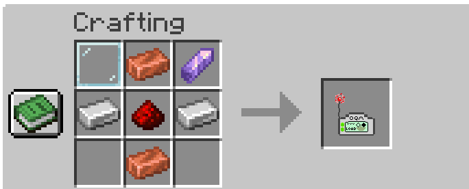

# OQM Minecraft Mod

This is a Minecraft mod to provide integration with the Open QuarterMaster system!

## Features

### Stage 1 (Current)
- Log items in chests to OQM server
  - Uses custom OQM chest logging item `Chest PDA`


### Future

 - Mod configuration screen
 - OQM specific chest
 - Chest naming / simple storage block management

#### Stage 2 (Issue #1017 on github)

 - (Above features)
 - 

## Installation and usage

### Building / Getting the mod
1. Build the mod using `./gradlew clean build`
2. Get the mod jar from `build/libs/`

### Installing in Minecraft
1. Install the correct NeoForge version (Currently 21.1.216 for Minecraft 1.21.1) [NeoForge](https://neoforged.net)
2. Place the mod jar in the `mods` folder of your Minecraft instance

### Single Player / Server
If Single Player, no additional setup is required.

For Multiplayer, use this guide from NeoForge: [Setting up a NeoForge Server](https://docs.neoforged.net/user/docs/server/)

### Setting up the Mod
1. From the Minecraft main menu, go to "Mods" -> "OQM Chest Tracker"
2. Enter your OQM server IP
3. Enter your OQM server client ID
4. Enter your OQM server client secret
5. Click Done

Your OQM server can now be accessed from within Minecraft!

### Mod Use in Game
1. Get a `Chest PDA` item (can be given using `/give @p oqm:chest_pda` command)
2. `Shift + Right Click` while holding the `Chest PDA` to open the chest logging interface

#### Chest PDA Recipe


## OQM Setup

Steps to get the OQM instance ready: (assuming Single Node Host deployment)

 1. Have an OQM instance running
 2. Add the following file:
    - Name: `/etc/oqm/kcClients/McMod.json`
    - Content:
      ```json
      {
        "clientName": "minecraft-mod",
        "displayName": "Minecraft Mod",
        "description": "",
        "roles": {
        }
      }
      ```
 3. Get client secret: `oqm-config g infra.keycloak.clientSecrets.minecraft-mod`

## Development Notes
- Minecraft Version: 1.21.1
- NeoForge Version: 21.1.216